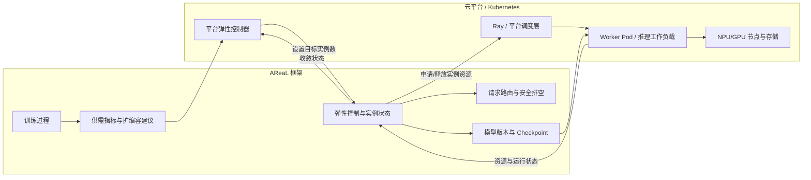
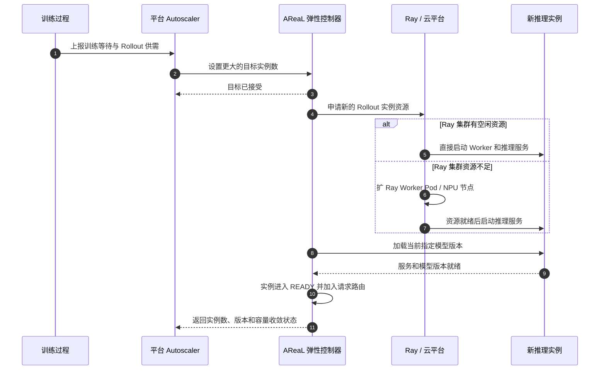
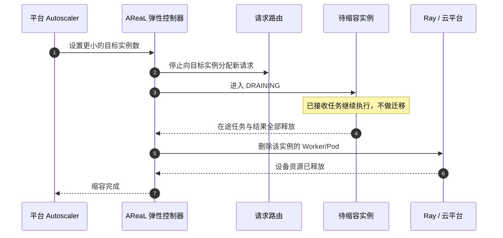
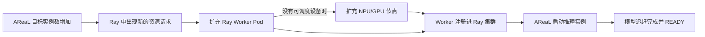

# AReaL Rollout 弹性扩缩容与平台集成设计

## 1. 文档目的

本文用于 AReaL 团队与云平台、Kubernetes 和资源调度团队讨论 Rollout 弹性扩缩容 的集成方式，重点说明：

- AReaL 当前具备什么能力；
- 框架与平台如何分工；
- 一次扩容和缩容如何完成；
- 双方需要对接哪些接口和状态；
- 第一阶段应该优先落地什么。

本文是一份架构沟通稿，不展开框架内部类、配置项和代码实现。

## 2. 核心设计

AReaL 将一个可以独立执行 Rollout 推理的服务单元称为 Rollout 实例，并根据训练侧 Rollout 的生产和消费情况动态调整实例数量。

平台提供计算资源，不直接决定一个新实例何时能够接收请求；AReaL 负责启动推理服务、 追赶模型版本并管理流量。只有这些步骤全部完成，新实例才会成为有效 Rollout 容量。

```text
资源已分配 != 推理服务已就绪 != 模型版本已就绪 != 有效 Rollout 容量
```

这套方案的重点不是简单增加或删除 Pod，而是在训练持续更新模型的过程中，确保新实例 以正确的模型版本加入服务，缩容实例在安全排空后退出服务。

## 3. 总体架构



架构中存在两个相互配合的控制闭环：

1. **AReaL 实例闭环**：判断需要多少 Rollout 实例，并管理启动、版本追赶、路由和排空。
1. **平台资源闭环**：为实例提供 Worker Pod、NPU/GPU 节点、网络和共享存储。

当前运行方式下，AReaL 通过 Ray 申请资源。Ray 集群有空闲资源时可以直接启动实例； 资源不足时，需要平台扩充 Ray Worker Pod，必要时继续扩充底层
NPU/GPU 节点。

## 4. 框架内部已经实现的能力

AReaL 当前已经形成完整的 Rollout 实例控制闭环：

1. **供需感知**：采集训练等待时间、Rollout 生产量和消费量，按训练窗口生成推荐实例数。
1. **目标状态管理**：接收目标实例数，由后台控制循环持续比较目标容量和实际容量。
1. **实例生命周期**：按需创建 Ray Worker，启动推理引擎和服务，并管理启动、就绪、排空、停止和失败状态。
1. **请求路由**：只向 READY 实例分配新任务，并记录每个实例正在处理的任务和返回结果。
1. **模型版本门控**：新实例加载当前 checkpoint、确认模型版本后才进入 READY；实例追赶与训练权重更新相互协调。
1. **安全缩容**：缩容实例先停止接收新任务，已有任务和结果全部释放后才删除 Worker。
1. **容量发布**：根据 READY 实例数量刷新框架实际可用的 Rollout 并发容量。
1. **持久化恢复**：保存目标容量、模型版本和 checkpoint；Controller 重启后清理旧资源并重新收敛。
1. **可观测性**：输出资源创建、Worker、推理服务、Proxy、模型追赶和容量生效等阶段的耗时及错误。

部分 Agent 场景还会使用 AReaL 内部的实例专属 Proxy，将 OpenAI 风格请求转发到对应推理服务。这里的 Proxy 是框架组件，不是 Kubernetes
Ingress 或平台 API Gateway。

## 5. 框架向外部暴露的能力

### 5.1 HTTP 控制与状态接口

| 接口                                  | 方向         | 平台用途                              |
| ------------------------------------- | ------------ | ------------------------------------- |
| `GET /elastic/scaling-recommendation` | AReaL → 平台 | 读取训练侧推荐实例数和指标依据        |
| `PUT /elastic/desired-instances`      | 平台 → AReaL | 设置目标 Rollout 实例数               |
| `GET /elastic/desired-instances`      | AReaL → 平台 | 查询当前目标实例数                    |
| `GET /elastic/instances`              | AReaL → 平台 | 查询 READY 数量、模型版本、容量和错误 |

`PUT` 是异步目标状态接口：响应成功表示目标已被接受，不表示资源已创建或容量已生效。平台需要继续查询状态，直到容量和模型版本收敛。

### 5.2 资源调度接口

AReaL 当前通过 Scheduler 抽象申请和释放资源。在现有 Ray 部署中，它负责：

- 向同一个 Ray 集群申请新 Worker 所需的 CPU、内存和 NPU/GPU；
- 等待 Worker 注册并获得网络地址；
- 在 Worker 中启动推理引擎、vLLM 服务和可选框架 Proxy；
- 缩容完成后删除对应 Worker并释放 Ray 资源。

平台可以继续使用 Ray 作为资源接入层，也可以后续实现平台 Scheduler Adapter。AReaL 当前不直接创建 Kubernetes Pod 或节点。

### 5.3 共享数据与观测输出

AReaL 还会向平台环境读写或输出：

- 共享存储中的模型 checkpoint、版本目录和恢复状态；
- 目标容量、READY 容量、模型版本和实际有效并发等运行状态；
- 带扩容批次、实例标识、阶段耗时和错误原因的日志。

## 6. 平台职责与共同约定

### 6.1 平台负责

- 提供 Ray Worker Pod 或等价的推理工作负载；
- 管理 NPU/GPU 配额、节点供给、设备分配和资源回收；
- 保证 Controller、Worker 和推理服务之间的网络连通；
- 提供所有相关实例可访问的 checkpoint 共享存储；
- 提供镜像、驱动、CANN/CUDA 和推理运行环境；
- 将资源排队、Pod 调度、节点扩容和失败状态反馈给控制面；
- 提供生产环境所需的鉴权、TLS、审计、告警、高可用和失败重试；
- 清理 Controller 异常退出后可能残留的孤儿资源。

### 6.2 双方共同定义

- 一个 Rollout 实例对应的平台工作负载形态和资源规格；
- 实例、Ray Worker、Pod 和节点之间的统一标识；
- 资源申请、排队、就绪、失败和删除的状态协议；
- 扩容超时、重试、退避和熔断策略；
- 模型版本就绪与平台 readiness 状态如何映射；
- Controller 重启或平台资源残留时，以哪一侧状态为准。

## 7. 扩容流程



扩容过程需要注意：

- 设置目标实例数是异步操作，接口成功不代表新容量已经生效；
- Pod 或 Worker 启动只代表资源和进程可用，不能直接视为模型就绪；
- 新实例加载权重期间不接收 Rollout 请求；
- 同一批新实例使用一致的目标模型版本；
- 模型版本和服务都确认后，实例才进入 READY 并计入有效容量。

## 8. 缩容流程



`DRAINING` 是缩容中的安全排空阶段：实例仍然运行并占用设备，但不再接收新任务； 已有任务和结果使用结束后，AReaL 才通知平台释放资源。

因此平台不应在收到缩容建议后直接删除 Pod，否则可能中断正在执行的 Rollout 请求。

## 9. 模型版本一致性

在线强化学习过程中，训练模型持续更新。扩容可能与一次新的权重更新同时发生，因此新 实例不能只加载任意一个可用 checkpoint 后就开始服务。

AReaL 当前通过以下规则保证一致性：


- 训练权重更新和新实例版本追赶会进行协调，避免交叉覆盖；
- 新实例在版本追赶完成前不可路由；
- 稳定状态下，所有 READY 实例使用相同 serving version；
- 正在被加载的 checkpoint 不能被提前清理。

平台需要保证 checkpoint 共享存储在实例之间路径一致、持续可见，并且平台侧存储清理 策略不会删除仍被 AReaL 使用的版本。

## 10. 框架与平台联动方式

平台 Autoscaler 与 AReaL 的基本联动方式是：

```text
读取建议和当前状态
  → 执行冷却、配额、审批和安全策略
  → 设置目标实例数
  → 必要时扩充 Ray Worker Pod 或底层节点
  → 持续查询状态直到容量和模型版本收敛
```

生产集成时，建议以以下条件判断扩容完成：

- READY 实例数达到目标实例数；
- READY 实例的模型版本与当前服务版本一致；
- 需要框架 Proxy 的场景中，Proxy 已经就绪；
- 当前没有正在进行的权重版本切换；
- 没有未处理的扩缩容错误。

生产环境需要由平台为 AReaL HTTP 接口补充服务发现、鉴权、TLS、审计、重试和单写者保护。后续如果需要 Kubernetes 原生管理方式，可以再封装成 CRD 和
Operator，不建议第一阶段直接从 CRD 开始。

### 10.1 平台资源联动

当前资源链路可以理解为：



只扩 Ray Worker Pod 不会自动增加 AReaL 的目标实例数；只增加目标实例数而没有平台 资源时，新实例会等待资源。平台 Autoscaler
需要协调这两个动作。

不建议让 Kubernetes HPA 直接修改 Rollout Pod 副本数。HPA 只理解 Pod 数量，无法 处理 AReaL 的模型版本追赶、READY 路由和
DRAINING 排空语义。第一阶段更适合由平台 Autoscaler 调用 AReaL 接口，并通过 Ray 或平台调度层提供资源。

## 11. 当前性能现状

在一次 4B 模型、Ascend、单实例扩容测试中，主要阶段耗时约为：

| 阶段                 |    示例耗时 |
| -------------------- | ----------: |
| 资源与 Worker 创建   |    约 55 秒 |
| vLLM 推理服务启动    |   约 105 秒 |
| AReaL 实例专属 Proxy |    约 28 秒 |
| 模型版本追赶         | 约 1～10 秒 |
| 单实例总体扩容       |   约 191 秒 |

当前瓶颈主要是推理服务和运行环境冷启动，而不是增量模型版本追赶。平台接入后应进一步 拆分并观测：

- 资源排队和配额准入；
- Worker Pod 调度和底层节点扩容；
- 镜像、运行环境和设备初始化；
- 推理服务启动；
- checkpoint 加载；
- READY 到有效容量生效。

如果缩容目标是将设备真正归还给其他任务，就需要删除 Worker Pod，并接受下一次完整 冷启动。vLLM sleep 可以缩短唤醒时间，但通常仍占用 Kubernetes
分配的设备，不能视为 真正释放资源。

## 12. 第一阶段集成建议

建议第一阶段保持 AReaL 现有实例和版本控制逻辑，只接入平台资源层：

```text
平台 Autoscaler
    ↓ 读取建议、设置目标、等待收敛
AReaL 弹性控制器
    ↓ 申请/释放 Rollout 实例
Ray on Kubernetes 或平台 Scheduler Adapter
    ↓
Ray Worker Pod 与 NPU/GPU 节点
```

第一阶段目标：

1. 打通目标实例数与平台资源扩缩的闭环；
1. 保证新增 Worker 能加入同一个 Ray 集群并正确上报设备资源；
1. 打通共享 checkpoint、网络和实例删除；
1. 用统一 ID 串联扩容请求、实例、Ray Worker、Pod 和节点日志；
1. 验证训练期间 `1 → 2 → 1`，包括模型版本追赶和安全排空；
1. 在资源不足、启动超时和 Controller 重启场景下完成故障验证。

待第一阶段稳定后，再考虑：

- Kubernetes CRD/Operator；
- Controller 高可用；
- 基于冷启动耗时的提前扩容；
- 镜像、模型和编译缓存感知调度；
- 保留少量设备资源的 Warm 实例池。

## 13. 首次会议需要确认的问题

建议与平台团队优先确认以下问题：

1. 平台当前如何扩充 Ray Worker Pod，它们如何注册进现有 Ray 集群？
1. Ray 资源不足时，能否自动触发 Worker Pod和底层 NPU/GPU 节点扩容？
1. 由谁运行生产 Autoscaler，并拥有目标实例数的唯一写权限？
1. 平台如何向 AReaL 返回资源排队、Pod 调度、节点扩容和失败状态？
1. checkpoint 使用哪种共享存储，访问路径和清理规则如何保证一致？
1. Controller、Ray Worker、推理服务和框架 Proxy 的网络如何打通？
1. 实例、Ray Worker、Pod 和节点使用什么统一标识？
1. 缩容时，平台如何等待 AReaL 排空完成后再删除资源？
1. Controller 或平台异常退出后，如何发现和回收残留资源？
1. 首期扩容时延目标、资源等待上限、重试和告警标准是什么？

## 14. 建议验收场景

- 有空闲 Ray 资源时，AReaL 能完成扩容并加载正确模型版本；
- Ray 资源不足时，平台能扩 Worker Pod，必要时扩底层节点，再继续实例启动；
- 新实例 READY 前不会接收 Rollout 请求；
- 缩容实例停止接收新请求，并在已有任务完成后释放设备；
- Controller 重启后能够恢复目标容量并重新收敛；
- 资源长期不足或实例启动失败时不会形成无限高频创建；
- 日志能够区分平台资源等待和框架推理服务初始化耗时；
- 全流程完成一次训练不中断的 `1 → 2 → 1`。
