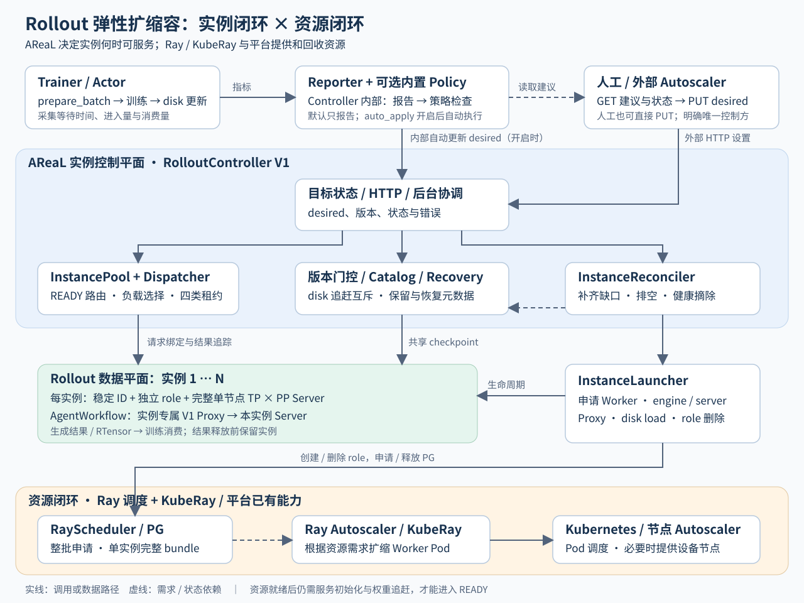
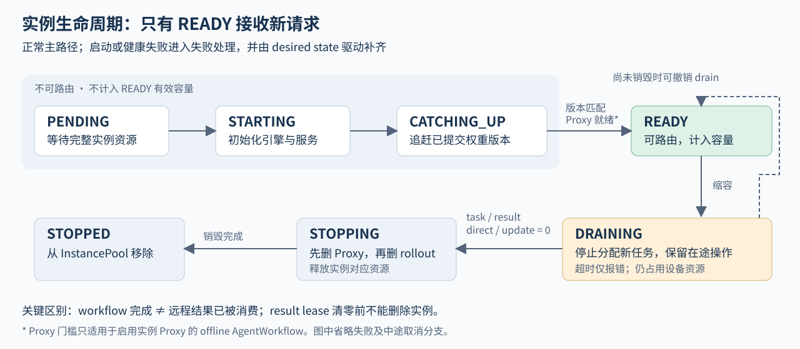
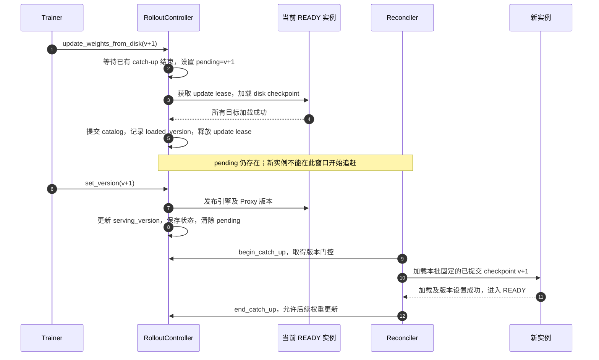

# AReaL Rollout 弹性扩缩容

运行期间按需调整推理实例数量，协调资源供给、模型版本与在途任务。

## 1. 扩缩对象：完整的 Rollout 实例

强化学习训练中，Actor 持续消费 rollout 数据并更新模型。生成与训练速度不匹配，会造成训练等待或推理资源闲置。

**扩缩容以完整 `TP × PP` 实例为单位，已有实例内部的并行组保持不变。**

- 每实例拥有独立 Scheduler role、稳定 `instance_id` 和 `engine_name`。
- 每实例对应一个逻辑 Worker，由其启动 TP/PP 推理进程。
- 单个实例位于一个节点内；不同实例可以分布在不同节点。
- AgentWorkflow 使用实例专属 V1 Proxy，通过 fork role 创建，不另申请 PG。

| 示例：TP=2，PP=1 | 扩容前 | 扩容后 |
| ---------------- | ------ | ------ |
| Rollout 实例数   | 1      | 3      |
| 每实例设备数     | 2      | 2      |
| Rollout 总设备数 | 2      | 6      |

当前路径：V1 RolloutController + single-controller + Ray + disk 权重同步 + offline workflow。

扩容需要完成模型追赶后接流量；缩容需要完成任务与结果排空后释放资源。

## 2. 总体架构：实例控制与资源供给协同



实线：控制或数据调用。虚线：状态与资源需求。平台资源闭环由部署环境提供。

**目标实例数支持两种控制方式：默认由外部设置，也可开启内部自动决策。** 图中的 Reporter 和内置 Policy 均属于
Controller，单独绘出是为了展示决策路径。

| 控制方式         | 配置与调用路径                                                                                                                                                 |
| ---------------- | -------------------------------------------------------------------------------------------------------------------------------------------------------------- |
| 外部控制（默认） | `auto_apply_scaling_recommendations=false`：Reporter 生成建议 → 外部 autoscaler 通过 HTTP GET 获取建议与状态 → HTTP PUT 设置 desired；人工也可直接设置 desired |
| 内部自动控制     | `auto_apply_scaling_recommendations=true`：Reporter 生成建议 → 内置 Policy 检查执行门槛 → 直接更新 desired，无需外部 HTTP 触发                                 |

两条路径均由 Reconciler 根据 desired 执行实例扩缩容。内部自动控制也依赖报告，不是每次采集指标后立即扩缩容；底层 Pod/节点的扩缩容仍由平台资源闭环负责。

| 组件                            | 职责                                    |
| ------------------------------- | --------------------------------------- |
| Trainer / Reporter / Policy     | 采集供需指标，生成建议，判断是否执行    |
| RolloutController               | 统一目标状态、HTTP 入口、版本与恢复协调 |
| InstancePool                    | READY 路由、请求绑定、在途租约记账      |
| Reconciler                      | 持续推进启动、追赶、排空和健康摘除      |
| InstanceLauncher / RayScheduler | 申请资源、启动服务、销毁实例            |
| Catalog / RecoveryStore         | checkpoint 保留与恢复元数据             |

**AReaL 实例闭环：** 训练指标 → 目标实例数 → 服务启动 / 版本追赶 → READY 容量。

**平台资源闭环：** pending PG 需求 → Ray/KubeRay 扩 Worker Pod → 必要时扩节点 → 资源可调度。

有空闲资源时直接分配；释放 PG 后，Pod/节点按平台空闲策略回收。实例、Worker、Pod、节点之间不要求一一对应。

## 3. 扩容：资源就绪后，还要完成服务与版本就绪



**只有 READY 实例接收新请求并计入有效容量。**

目标实例数从 1 调整到 3：

1. 注册两个新实例，记录启动意图，进入 `PENDING`。
1. 批量申请资源，让 Ray 一次看到完整缺口。
1. 分配 Worker，限并发启动 engine、server 和可选 Proxy。
1. 按最新 desired 保留需要的实例，整批确定共同 checkpoint。
1. 完成权重追赶，进入 `READY`，更新路由与有效并发。

失败实例清理，成功实例保留；后续 reconcile 继续补齐缺口。

首次版本 0 尚无已提交 checkpoint 时，使用启动时加载的基础模型；非零版本必须能找到准确匹配的已提交 checkpoint。

| 阶段       | 默认设置                  | 语义                         |
| ---------- | ------------------------- | ---------------------------- |
| 等待资源   | 900 秒超时                | 包含可能的 Pod/节点扩容      |
| 初始化服务 | 并发 2；每实例 300 秒超时 | 获得启动槽位后开始计时       |
| 权重追赶   | 并发 4                    | 限制共享 checkpoint 加载压力 |
| 后台循环   | 每轮结束后等待 5 秒       | 实际收敛时间取决于各阶段耗时 |

当前批次有两处等待屏障：资源等待全部结束后才激活成功 reservation；初始化批次收齐结果后才开始追赶。先获得资源的实例仍可能等待同批其他实例。

## 4. 路由与缩容：在途数据决定何时释放资源

新请求优先分配给在途请求最少的 READY 实例，同负载时轮询。选择与占用在同一 Pool 锁内完成，避免与缩容删除发生竞态。

负载口径为 workflow task 数 + direct request 数。任务绑定实例，AgentWorkflow 使用同实例
Proxy；已有任务不迁移，新实例承接后续流量。

有效并发上限为：

```text
C_effective = min(C_total, N_READY × C_per_instance)
```

**增加实例数，默认不提高原有全局并发上限。** 两个 elastic 并发参数未配置时，均回退到原 rollout 并发值。

| 原并发 32，实例数 1 → 2  | 有效并发变化 |
| ------------------------ | ------------ |
| 不设置 elastic 并发参数  | 32 → 32      |
| 单实例上限 32，总上限 64 | 32 → 64      |

实际吞吐还受训练消费、staleness 和推理负载影响。

缩容先将选中实例标记为 `DRAINING`，停止分配新任务，然后等待四类占用全部归零：

| 占用              | 为什么阻止删除                                                   |
| ----------------- | ---------------------------------------------------------------- |
| `active_tasks`    | workflow 尚在执行或结果尚未取回                                  |
| `result_leases`   | workflow 已完成，但返回的远程 RTensor 仍被 buffer/训练消费者引用 |
| `direct_inflight` | 直接推理或相关 RPC 尚未结束                                      |
| `update_leases`   | 权重更新快照仍在使用此实例                                       |

**任务完成后，远程结果可能仍被训练引用。** `release_batch()` 释放已消费 batch 对应的 result lease；dispatcher
中等待消费的结果继续保留实例。

四类占用全部归零 → `STOPPING` → 删除 Proxy role → 删除 Rollout role → 移出 Pool。

drain 默认 300 秒超时，超时只报错、不强删；尚未销毁时可因新扩容需求撤销 drain。

## 5. 权重一致性：加载完成后再发布服务版本



**权重更新与新实例追赶互斥。** 哪一方先取得门控，另一方就等待；服务冷启动在门控外执行。

`pending_update_version` 从 disk 更新开始保持到 `set_version()` 完成，防止新实例在“权重已加载、版本尚未发布”的窗口加入服务。

稳定状态下：所有 READY 实例的 `loaded_version == serving_version`，且
`pending_update_version == null`。历史样本的时效性仍由原训练机制管理。

- Catalog 只登记成功更新后的 checkpoint，默认保留最近 3 个及仍被依赖的版本。
- 追赶时提前记录目标 `loaded_version` 以保护 checkpoint；是否可服务仍以 READY 为准。
- GC 先更新元数据，再删除旧目录。
- 部分更新失败会向上抛出异常，当前不提供自动回滚。

## 6. 自动决策：根据训练等待调整容量

| 指标                   | 口径                                    |
| ---------------------- | --------------------------------------- |
| `wait_seconds`         | 本次 `prepare_batch()` 耗时             |
| `step_seconds`         | 相邻两次取 batch 完成时刻之差           |
| `entered` / `consumed` | accepted rollout 增量 / 取出 batch 长度 |

默认每 10 个训练版本生成报告，首个无配对时间的样本不计入时间统计：

```text
w = min(Σwait_seconds / Σstep_seconds, 0.95)

w > 0.10                       → ceil(N_READY / (1 - w))
w < 0.05 且时间、生产、消费有效 → N_READY - 1
其他                           → 保持

最终目标限制在 [min_instances, max_instances] 内
```

| 当前 2 个实例         | 推荐实例数         |
| --------------------- | ------------------ |
| 等待占比 20%          | 3：`ceil(2 / 0.8)` |
| 等待占比 7%           | 2：保持            |
| 等待占比 3%，样本有效 | 1：试探缩容        |

5% 和 10% 均落在保持区间；最终目标受 min/max 限制。策略是启发式估算，实际收益取决于负载。

AReaL 按 `prepare_batch` 需求驱动生成，`consumed/entered` 即使在容量富余时也可能接近 1，因此缩容采用每次减少一个实例的试探方式。

默认只报告，不自动根据建议调整 desired；开启 `rollout.elastic.auto_apply_scaling_recommendations` 后，内置
Policy 在报告生成后检查下述门槛，通过后直接更新 desired，无需外部程序读取报告或发起 HTTP 请求。外部 autoscaler 示例复用同一策略，通过 HTTP
获取建议与状态、设置 desired；人工设置 desired 无需先生成报告。

实际执行还需通过这些门槛：

- 按 `report_version` 去重；启动首份报告用于建立版本水位。
- 当前实例全部 READY、数量达到 desired、版本一致、Proxy 就绪，且无 pending update/reconcile error。
- 报告容量与当前容量一致，窗口起点严格晚于启动或最近收敛水位。
- 连续扩容默认冷却 0 秒；连续缩容和方向反转默认 30 秒，从动作收敛后计时。
- 缩容默认要求两个相邻有效低等待窗口，每个收敛周期最多减少一个实例。

冷却或容量未收敛期间的报告直接丢弃，不会重放。HTTP 修改 desired 会重置水位，但不会关闭内部策略；手动控制与自动控制需要明确执行方。

## 7. 当前能力与边界

支持 V1、Ray、disk 和 offline workflow；弹性默认关闭。V2、AWEX / distributed 权重同步、跨节点单实例和动态 online
Proxy session 尚未支持。开启弹性后，独立 validation rollout 跳过并告警。

| 场景                        | 当前行为与限制                                                         |
| --------------------------- | ---------------------------------------------------------------------- |
| 部分实例启动/追赶失败       | 清理失败实例，保留成功实例，按 desired 继续补齐                        |
| READY 实例健康失败          | 默认连续 3 次失败后摘出路由，创建替代实例；旧资源仍等待可见 lease 清空 |
| Worker/节点故障上的任务     | 不迁移，也不自动重试；可能失败或超时                                   |
| 长时间资源不足              | 资源等待超时后后续轮次继续申请；当前没有指数退避和熔断                 |
| drain 长期不归零            | 保留资源并报告错误，需要定位 task、result、direct 或 update 哪类未释放 |
| 非零版本缺少准确 checkpoint | 恢复明确失败，避免用错误版本启动                                       |

配置 `rollout.fileroot` 后，按 experiment/trial 保存 desired、serving version、checkpoint 和
role。恢复时校验 checkpoint、尝试清理旧 role、重建容量；在途 workflow/result 不恢复。

健康检查覆盖 launcher/Worker 进程、Worker HTTP `/health` 和相关 Proxy role，尚不覆盖端到端生成质量。

**恢复元数据不等于完整灾备。** RayScheduler 的 role/PG/actor 映射保存在进程内，PG 和 launcher actor 未命名。全新
Controller 的旧资源发现、孤儿资源回收及 Ray head/GCS 灾备仍需平台能力与独立验收。

验证资产包括核心逻辑单测、HTTP / autoscaler spike 和 KubeRay 验收指导。测试代码与验收流程的存在，不代表真实集群验收已经通过。

## 8. 运行示例：1 → 2 → 1

示例采用手动设置目标实例数，单实例并发上限 32，总上限 64。以下片段合并到已有训练配置，模型、存储和资源参数沿用实际环境。

```yaml
actor:
  weight_update_mode: disk
scheduler:
  type: ray
rollout:
  elastic:
    enabled: true
    min_instances: 1
    initial_instances: 1
    max_instances: 2
    max_concurrent_rollouts_per_instance: 32
    max_total_concurrent_rollouts: 64
    auto_apply_scaling_recommendations: false
    report_freq_steps: 10
```

运行前提：single-controller 模式、匹配 Worker 的 Ray 设备资源键，以及一致可见的共享 checkpoint 路径。

`BASE_URL` 为 Controller callback 地址；以下为 Bash 命令：

```bash
curl "$BASE_URL/elastic/instances"
curl "$BASE_URL/elastic/scaling-recommendation"

curl -X PUT "$BASE_URL/elastic/desired-instances" \
  -H "Content-Type: application/json" \
  -d '{"desired_instances":2}'

# 观察扩容完成、训练继续推进，再发起缩容。
curl -X PUT "$BASE_URL/elastic/desired-instances" \
  -H "Content-Type: application/json" \
  -d '{"desired_instances":1}'
```

**PUT 成功表示目标已接受；READY 与版本状态表示容量真正生效。**

| 时刻     | AReaL 观察项                                     | Ray/KubeRay 观察项                  |
| -------- | ------------------------------------------------ | ----------------------------------- |
| 起点     | 1 个 READY，至少完成一次 disk 更新               | 原有 PG/Worker                      |
| 扩容中   | 新 instance ID，PENDING → STARTING → CATCHING_UP | PG demand、资源分配、必要时新增 Pod |
| 扩容完成 | 2 个 READY，版本一致，并发上限达到配置值         | 新资源被实例持有                    |
| 缩容中   | DRAINING 不接新任务，四类 lease 逐步归零         | 资源仍占用                          |
| 缩容完成 | 1 个 READY，旧实例已移除，训练继续               | PG 已释放；Pod 回收可能滞后         |

收敛条件：

- 实例总数和 READY 数均等于 desired，无残留 DRAINING/FAILED 实例。
- 所有 READY 实例版本匹配，`pending_update_version == null`。
- 启用 Proxy 时全部就绪，`last_reconcile_error == null`。

自动模式开启 `auto_apply_scaling_recommendations=true`，形成“报告 → 策略决策 → desired →
READY”闭环；`last_autoscaler_decision` 提供决策依据。

后续重点：缩短容量生效时间、用真实负载校准并发与阈值、完善资源申请退避及跨进程恢复。

## 附录：代码与验证入口

代码基线：`refactor/elastic-rollout-clean-history` / `4c8f8166`，2026-09-09。内容依据源码整理，未在本次整理中执行
NPU/KubeRay 集成测试。

- [训练接入与指标采集](../../../areal/trainer/rl_trainer.py)：训练模式校验、`prepare_batch`
  计时、版本发布后的报告生成。
- [Controller 主入口](../../../areal/infra/controller/rollout_controller.py)：`_initialize_elastic`、HTTP
  路由、`_elastic_autoscaler_status`、`update_weights_from_disk`、`set_version`、`release_batch`。
- [实例调谐](../../../areal/infra/controller/elastic/reconciler.py)：`reconcile_once`
  的批量扩容、共同版本追赶、排空与补齐。
- [路由与租约](../../../areal/infra/controller/elastic/instance_pool.py)、[实例状态模型](../../../areal/infra/controller/elastic/models.py)：`reserve_task`、`begin_stop_if_drained`、`is_drained`。
- [实例启动](../../../areal/infra/controller/elastic/launcher.py)、[Ray 调度](../../../areal/infra/scheduler/ray.py)：资源申请、服务启动与清理。
- [报告计算](../../../areal/infra/controller/elastic/scaling_report.py)、[有状态策略](../../../areal/infra/controller/elastic/autoscaler.py)：阈值、窗口水位、连续缩容确认与冷却。
- [配置定义](../../../areal/api/cli_args.py)：`ElasticRolloutConfig` 的默认值和校验。
- [核心单测目录](../../../tests/infra/controller/elastic)、[Controller 测试](../../../tests/test_rollout_controller.py)：逻辑与集成
  mock 覆盖。
- [KubeRay 验证指导](rollout_elasticity_kuberay_validation.md)、[平台集成说明](rollout_elasticity_platform_integration.md)：环境准备、资源短缺与故障注入验收。

配置补充：single-controller 入口可使用 `AREAL_SPMD_MODE=false`；Hydra 新增未声明字段使用
`+rollout.elastic.xxx=...`；CPU-only Ray head 显式配置匹配 Worker 的
`cluster.ray_device_resource=NPU` 或 `GPU`。

`rollout_elastic_autoscaler_spike.py --inject-spike` 用于模拟指标驱动的链路验证；真实负载自适应效果需单独测量。
